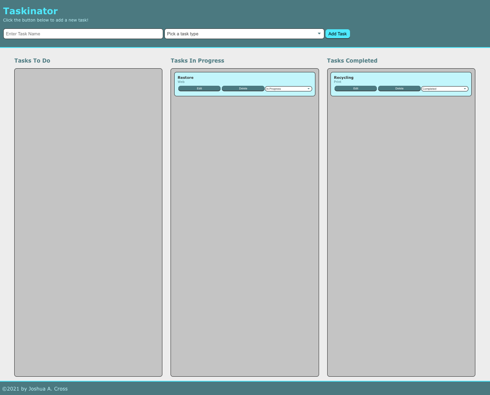

# TASKINATOR

## Description
Modern, front-end web developed task application that is fully interactive and saves to localStorage by accessing the DOM to create elements, set and get attributes, add event listeners, and update tasks name and statuses. 

* Accessed the DOM using methods like addEventListener(), querySelector(), createElement(), setAttribute(), and getAttribute().

* Added interactivity with HTML by adding browser event listeners such as click, submit, and change.

* Handled events in JavaScript using callback functions.

* Used the event object.

* Used the DOM to both read content from the HTML page and create new content to add to or edit on the page.

* Identified DOM elements using HTML5 data attributes so that we can interact with them.

* Stored task items in an organized list using an array of objects.

* Synced the data with the display in the browser.

* Saved data using localStorage, and serialize and de-serialize the data using JSON.stringify() and JSON.parse().

* Tracked technical debt and refactor the code as needed.

* Worked with Github Issues and Feature Requests

Website Link:

Reference Images:

